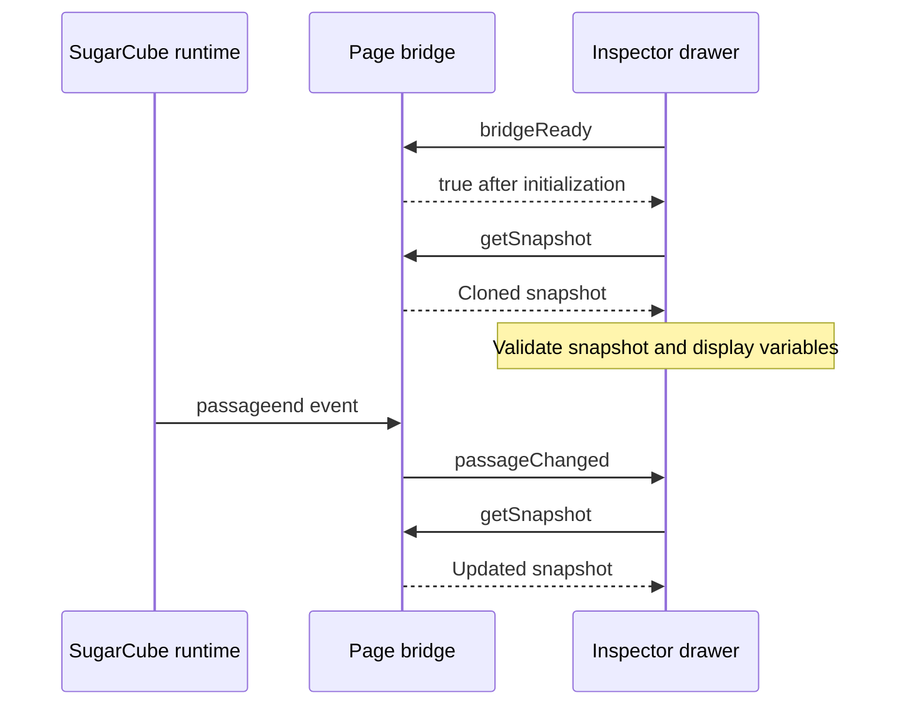

# SugarCube Inspector

A Chromium extension for inspecting local Twine stories that use SugarCube.
An injected drawer displays the current story and temporary variables, and a
browser side panel reports the active story's identity and current passage.

The extension uses WXT, React, TypeScript, Tailwind CSS, and a typed custom-event
RPC bridge between the page's SugarCube runtime and the inspector.

## Features

- Expandable trees for story variables (`$`) and temporary variables (`_`).
- Automatic snapshot refresh after SugarCube passage changes, plus a manual
  **Refresh** button.
- Live polling of visible variable rows and favorited paths, with batched,
  incremental updates.
- A drawer that opens on hover, supports resizing by dragging its edge, and has
  keyboard controls.
- Snapshot validation, request timeouts, and a **Retry** button for snapshot
  errors.
- A side panel showing SugarCube detection status, story name, current passage,
  and IFID when available.

## Build and install

Use Node.js 24 and npm to match the CI environment. Run these commands from the
repository root:

```sh
npm ci
npm run build
```

`npm ci` also runs WXT's preparation step, which generates the TypeScript
configuration under `.wxt`. The build creates a Chrome Manifest V3 extension
under `.output/chrome-mv3`.

To load it in Chrome:

1. Open `chrome://extensions` and enable **Developer mode**.
2. Select **Load unpacked** and choose `.output/chrome-mv3`.
3. Open **Details** for SugarCube Inspector and enable
   [**Allow access to file URLs**](https://developer.chrome.com/docs/extensions/develop/concepts/declare-permissions#allow-access).
4. Open or reload a local SugarCube story's HTML file in Chrome.

See [Chrome's unpacked extension guide](https://developer.chrome.com/docs/extensions/get-started/tutorial/hello-world#load-unpacked)
for the browser's installation steps. After rebuilding, reload the extension
from `chrome://extensions` and reload the story tab.

## Using the inspector

Move the pointer to the narrow handle at the right edge of the story page to
open the drawer. Drag the handle to adjust its width. With the handle focused,
**Enter** or **Space** toggles the drawer, and **Left Arrow** or **Right Arrow**
adjusts its width.

Expand the variable trees to inspect values. Passage changes refresh them
automatically; use **Refresh** to capture changes made without passage
navigation. If a snapshot request fails, the drawer shows the error and a
**Retry** button.

Visible variables are automatically watched for changes between passage events.
Use the star beside any variable to keep watching it when it is out of view or
in an inactive scope tab. Watches poll every 250 ms (and pause while the page is hidden). MAIN retains
an immutable full-snapshot baseline plus independent cached overrides for watched
paths. Each poll compares live values first and only clones changed values;
changes replace whole watched subtrees. Missing paths remain watched and are
shown as read-only placeholders until they reappear. Registrations store the target
and favorite status; row visibility is tracked separately so restored offscreen
paths can be released. Complex values such as
Maps and Sets are replaced in full when changed. Watch-performance notifications
are deferred pending a redesign; see
[deferred watch-performance notifications](docs/deferred-watch-performance-notices.md).
Favorites currently last for the lifetime of the inspector.

Select the extension's toolbar icon to open the side panel. Its **Refresh**
button checks the currently active tab for a local SugarCube story and updates
the displayed metadata.

## Development commands

| Command                | Purpose                                                        |
| ---------------------- | -------------------------------------------------------------- |
| `npm run dev`          | Start WXT development mode for Chrome.                         |
| `npm run build`        | Build the production Chrome MV3 extension.                     |
| `npm run zip`          | Package the Chrome extension as a ZIP under `.output`.         |
| `npm run compile`      | Check TypeScript with TypeScript 7, including the test suites. |
| `npm test`             | Run unit, startup, and RPC integration tests.                  |
| `npm run test:watch`   | Run Vitest in watch mode.                                      |
| `npm run test:browser` | Build the extension and run Chromium smoke tests.              |

The normal `tsc` command and CI use TypeScript 7. The `typescript` dependency
aliases the TypeScript 6 compatibility package for tools that need its compiler
API, including `typescript-eslint`; `@typescript/native` supplies TypeScript 7's
`tsc`. This follows
[Microsoft's side-by-side setup](https://devblogs.microsoft.com/typescript/announcing-typescript-7-0/#running-side-by-side-with-typescript-6-0).
Use `npx tsc --version` and `npx tsc6 --version` to check each compiler, or
`npx tsc6 --noEmit` to check the project explicitly with TypeScript 6.

The package also provides `npm run dev:firefox`, `npm run build:firefox`, and
`npm run zip:firefox`. Runtime support and automated browser coverage currently
target Chromium; Firefox support has not been validated.

## Testing

Before the first browser test run, install Playwright's bundled Chromium:

```sh
npx playwright install chromium --no-shell
```

On Linux, install its system dependencies as well:

```sh
npx playwright install --with-deps chromium --no-shell
```

Then run the checks:

```sh
npm run compile
npm test
npm run test:browser
```

Unit and startup tests cover snapshot validation, timeout handling, inspector
state transitions, bridge readiness, and cleanup. RPC integration tests use the
production page bridge and actual custom-event transport with a small SugarCube
fixture.

Browser smoke tests load the built extension with a real SugarCube 2.37.3 story
and check initial variables, updates after passage navigation, repeated reloads,
and manual refresh. The pinned story format is downloaded on the first run,
verified against a SHA-256 checksum, and cached for subsequent runs.

See [the testing guide](tests/README.md) for fixture details and Playwright trace
instructions.

## Continuous integration

The [GitHub Actions workflow](.github/workflows/ci.yml) runs on pushes to `main`,
pull requests targeting `main`, and manual runs. It uses Ubuntu 24.04 and Node.js
24, installs locked dependencies, checks TypeScript, runs the unit and
integration tests, then builds the extension and runs Chromium smoke tests.

Superseded runs on the same branch are cancelled. Failed browser runs upload
`test-results` as a `browser-test-results` artifact retained for seven days.
View results in [GitHub Actions](https://github.com/silentlie/sugarcube-inspector/actions).

## How the bridge works

The page bridge runs in the browser's `MAIN` world, where it can read SugarCube.
The inspector runs in an isolated content-script context and mounts its React
drawer in a shadow root. The two scripts communicate through
`@webext-core/messaging/page` using the `sugarcube-inspector:rpc:v1` namespace.



The bridge registers its readiness handler after successful initialization.
Readiness and snapshot requests have a three-second timeout. The inspector
validates snapshots with Zod and ignores superseded results or results received
after unmounting.


## Watch performance experiments

Experimental code compares specialized deep-equality traversal and reference
tracking, plus three polling strategies: compare-before-clone, clone-before-compare,
and always-clone. None of these experiments changes the production WatchService.
See [watch polling benchmarks](docs/watch-polling-benchmarks.md) for results,
including measurements of real Chromium MAIN-to-isolated-world
`@webext-core/messaging/page` transport.

Install benchmark-only dependencies without changing the project lockfile:

```sh
npm ci
npm install --no-save --package-lock=false --ignore-scripts fast-equals@6.1.1 fast-deep-equal@3.1.3 dequal@2.0.3 esbuild@0.28.2
npx playwright install chromium
npm run bench:watch:equality -- equality.json
npm run bench:watch:variants -- worker.json
npm run bench:watch:chromium -- chromium.json
```

The equality and worker-thread measurements run in Node.js; the Chromium script
bundles the project's actual custom-event RPC into two Chrome execution worlds
with synthetic watched values. Results, assumptions and correctness limitations
are recorded in [the benchmark notes](docs/watch-polling-benchmarks.md).

## Project structure

| Path                               | Responsibility                                                                               |
| ---------------------------------- | -------------------------------------------------------------------------------------------- |
| `entrypoints/content.tsx`          | Verify bridge readiness and mount the drawer.                                                |
| `entrypoints/sugarcube.content.ts` | Serve snapshots and emit passage-change notifications from the page.                         |
| `entrypoints/background.ts`        | Configure toolbar clicks to open the side panel.                                             |
| `entrypoints/sidepanel/`           | Detect the active local story and display its metadata.                                      |
| `src/inspector/`                   | Drawer, variable trees, request state, and error UI.                                         |
| `src/sugarcube/`                   | RPC contract, snapshot construction, and validation schema.                                  |
| `src/utils/`                       | Request timeout helper.                                                                      |
| `tests/`                           | Startup, transport integration, and browser tests; unit tests also live beside source files. |
| `docs/`                            | Deferred feature designs.                                                                    |

## Current scope and limitations

- Content scripts match local `file://` pages. The drawer requires
  `tw-storydata[format="SugarCube"]`; HTTP/HTTPS stories and other Twine formats
  are outside the current scope.
- The page bridge requires the story's SugarCube and jQuery runtimes to be
  available when it initializes. Startup makes one readiness request and does
  not reconnect automatically. If startup fails, check the page's developer
  console and reload the story to retry.
- The side panel checks metadata on initial load or manual refresh. It does not
  automatically follow tab switches or passage changes. Window-aware tab
  synchronization is documented in the
  [deferred side-panel design](docs/deferred-side-panel-tab-sync.md).
